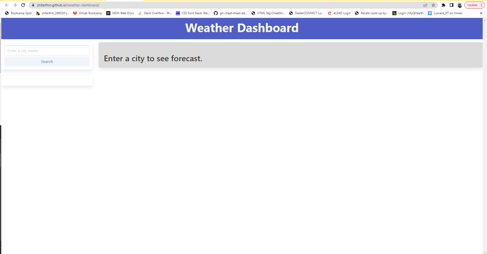
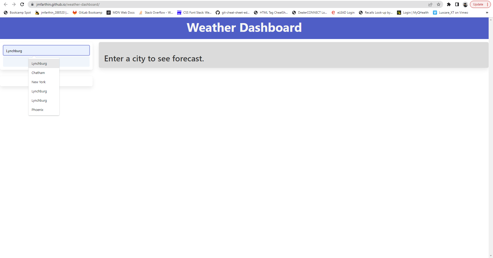
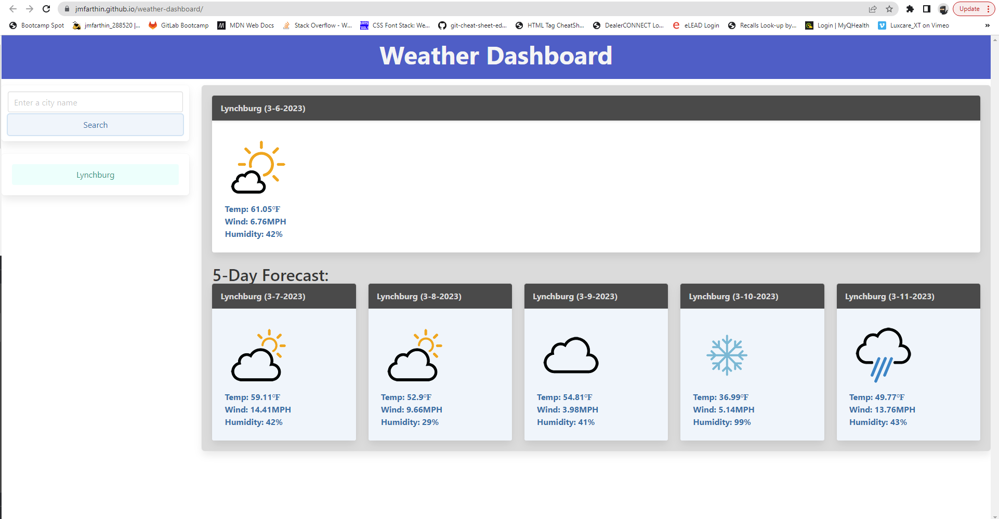
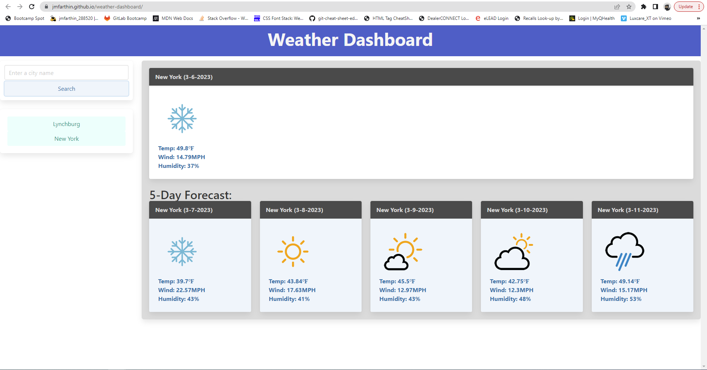
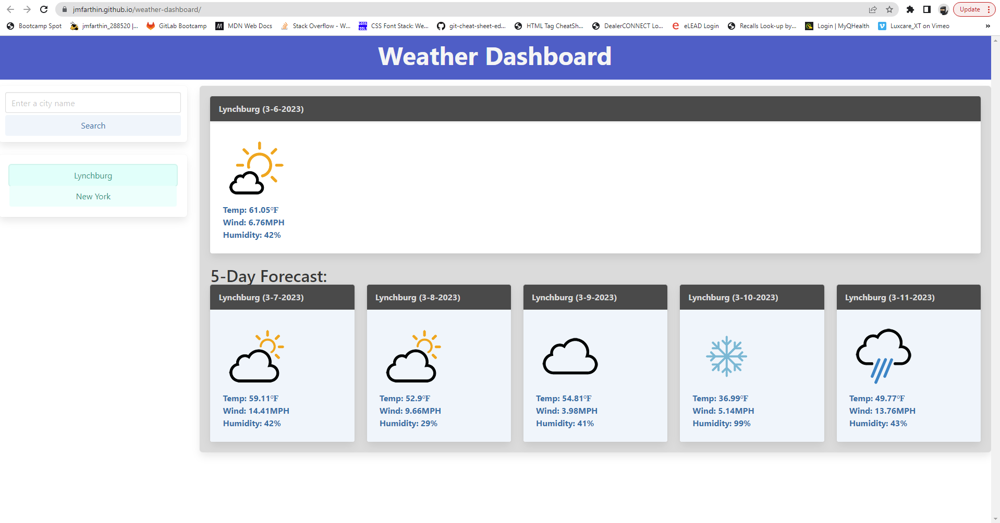

# weather-dashboard
This repo contains code for a weather forecasting application.

## Description

This project is a Weather Forecast App using the Open Weather API. It's purpose is to showcase my current knowledge of javascript and highlight certain proficiencies such as:

- server side APIs
- fetch
- event listeners
- local storage
- traversing the DOM

## Usage

To view the Weather Dashboard, visit: https://jmfarthin.github.io/weather-dashboard/

Repository: https://github.com/jmfarthin/weather-forecast.git

To use the app, type in a city in the search bar and submit. The current forecat and 5-day forecast will populate in to separate cards. A button will appear below the search bar for easy access to that forecast.

### Screenshots of deployed website:

# Credits

yuvraaaj (github username)- icon file from OpenWeather Map API
https://github.com/yuvraaaj/openweathermap-api-icons.git

## License

Licensed under the general usage MIT license.
Copyright (c) 2023 Justin Farthing
